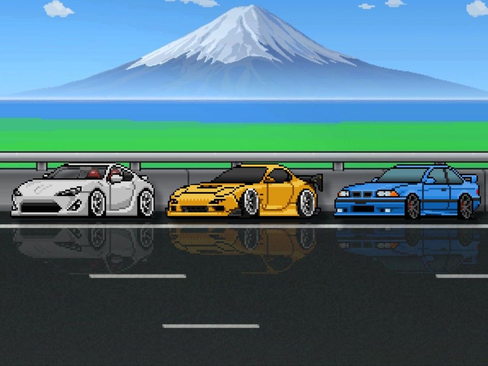

  <a class="boton-fucsia" href="como_se_juega.html">Cómo se juega</a>
  <a class="boton-fucsia" href="instalar_compilar.html">Cómo instalar, compilar y ejecutar</a>
  <a class="boton-fucsia" href="iniciar_juego.html">Iniciar juego</a>

 

 
 #Trabajo final taller(pagina web)
---

Este juego ha sido desarrollado por los alumnos: Lucas Pagani, Federico Zanor, Manuel Pato y Joaquin Schapira como trabajo practico final para la materia taller de programación en la facultad de ingenieria de la UBA. El trabajo consistia en desarrollar el mítico juego need for speed 2d permitiendo el multijugador para aplicar todo lo aprendido en la materia. 

### [Mira el video en youtube](https://youtu.be/ID62qAriQmw)

 

este es un link de youtube donde veran todas las features del trabajo.

